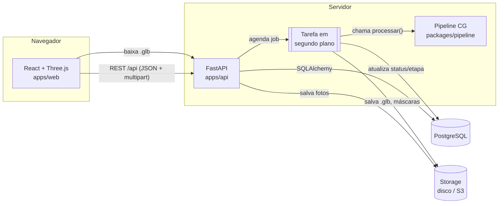

# 02 — Arquitetura

## Visão de componentes



## Fluxo principal: gerar um modelo

```mermaid
sequenceDiagram
    actor U as Usuário
    participant W as Web
    participant A as API
    participant D as PostgreSQL
    participant S as Storage
    participant P as Pipeline (segundo plano)

    U->>W: escolhe 3 fotos + tamanho (cm)
    W->>A: POST /modelos (multipart)
    A->>S: salva fotos
    A->>D: INSERT modelo, imagens, job(status=pendente)
    A-->>W: 202 {modelo_id, job_id}
    A->>P: agenda processar(job_id)
    loop a cada 1 s
        W->>A: GET /jobs/{id}
        A-->>W: {status, etapa_atual, progresso}
    end
    P->>D: etapa = segmentacao / alinhamento / visual_hull / marching_cubes / ...
    P->>S: salva modelo.glb (+ intermediários)
    P->>D: INSERT versao, arquivos; job.status = concluido
    W->>A: GET /modelos/{id}
    A-->>W: versão atual + URLs dos arquivos
    W->>U: visualizador 3D
```

## Onde a Computação Gráfica aparece em cada camada

| Camada | Conceitos de CG | Arquivos |
|---|---|---|
| Pipeline (back) | processamento de imagem (limiarização, morfologia), projeção ortográfica, voxelização, visual hull, Marching Cubes, malhas poligonais, normais, suavização (Taubin), decimação (erro quádrico), projeção de textura, mapeamento UV, LOD | `packages/pipeline/src/relevo_pipeline/*` |
| Front | pipeline gráfico/rasterização (WebGL), câmera perspectiva, transformações por matrizes homogêneas 4×4, iluminação e shading (flat × suave, PBR), shaders GLSL, raycasting, LOD por distância | `apps/web/src/components/*` |
| Banco | representação persistente de malhas e versões, matriz de transformação 4×4 por versão, parâmetros e métricas do pipeline (reprodutibilidade) | `apps/api/src/relevo_api/models.py` |

## Estrutura de pastas (alvo ao fim da Fase 3)

```
apps/api/src/relevo_api/
├── main.py            # cria o app, CORS, inclui routers
├── config.py          # Settings (.env)
├── db.py              # engine, sessão, Base
├── models.py          # ORM: usuarios, modelos, imagens, jobs, versoes, arquivos
├── schemas.py         # Pydantic (entrada/saída da API)
├── storage.py         # interface Storage + LocalStorage (S3Storage na Fase 4)
├── routers/
│   ├── modelos.py
│   ├── jobs.py
│   └── arquivos.py
└── servicos/
    └── processamento.py   # executa o pipeline e atualiza o job

apps/web/src/
├── pages/            # Home, NovoModelo, StatusJob, Modelos, ModeloDetalhe
├── components/       # ModelViewer, UploadSlot, EtapasJob, ...
├── lib/              # api.ts (cliente), modosRender.ts, geometria.ts (funções puras)
└── shaders/          # GLSL customizados (Fase 2)
```
