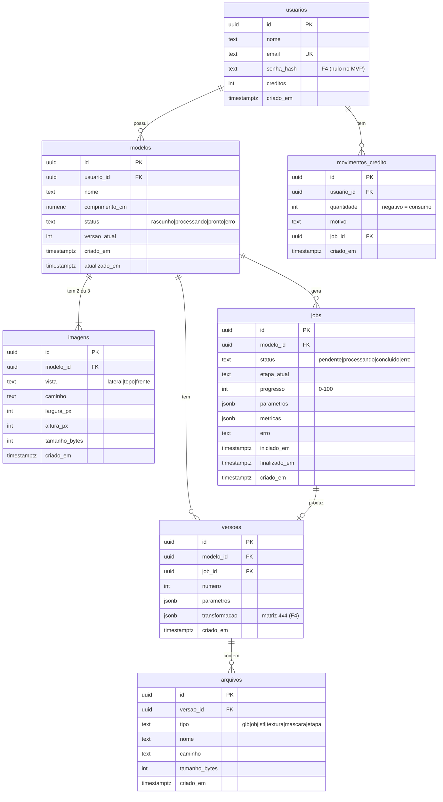

# 04 — Banco de dados

PostgreSQL 16. Toda mudança de esquema via **Alembic** (`apps/api/migrations`). Tabelas no plural, snake_case,
chaves primárias `UUID`, datas `timestamptz`.

Fase em que cada tabela nasce: **F3** = MVP, **F4** = produto.

## Diagrama ER



## Tabelas

### `usuarios` (F3; autenticação em F4)
No MVP existe um usuário **demo** criado por *seed* na migração; todas as requisições usam ele.
Na F4 entram `senha_hash` (Argon2) e login JWT. `email` único.

### `modelos` (F3)
O "projeto" do usuário: um calçado. `comprimento_cm` é o tamanho real informado (escala do modelo).
`versao_atual` aponta o número da versão exibida.

### `imagens` (F3)
Uma linha por foto enviada. **Restrição:** `UNIQUE (modelo_id, vista)`; `CHECK vista IN ('lateral','topo','frente')`.
O arquivo fica no Storage; aqui só o caminho e metadados.

### `jobs` (F3)
Cada execução do pipeline. O worker atualiza `etapa_atual` e `progresso` a cada etapa (o front faz *polling*).
- `parametros` (JSONB): `{"resolucao": 128, "suavizacao": 10, "faces_alvo": 20000, "preset": "ecommerce"}`
- `metricas` (JSONB): saída de `ResultadoPipeline.metricas` (faces, tempos, dimensões, fechada, IoU).
Índice em `(status)` para achar jobs travados no *startup*.

### `versoes` (F3)
Cada resultado aceito. `UNIQUE (modelo_id, numero)`. Na F4, editar escala/rotação/pivô cria nova versão com a
**matriz de transformação homogênea 4×4** em `transformacao` (lista de 16 números, ordem *column-major* como no Three.js).

### `arquivos` (F3)
Arquivos de uma versão: `.glb` principal, exportações `.obj/.stl` (F4), textura (F4), máscaras e malhas
intermediárias para o Raio-X (F5). `nivel_lod` (smallint, nulo = completo) entra na F5.

### `movimentos_credito` (F4)
Extrato de créditos. Saldo = `usuarios.creditos` (atualizado na mesma transação do movimento).

## Regras de integridade

- `ON DELETE CASCADE` de `modelos` para `imagens`, `jobs`, `versoes`; de `versoes` para `arquivos`.
- Apagar um modelo **também apaga os arquivos no Storage** (feito pela aplicação, não pelo banco).
- Status sempre via `CHECK` (ou `Enum` do SQLAlchemy com `native_enum=False`).

## Consultas importantes

```sql
-- Biblioteca "Meus modelos" com a versão atual e o .glb
SELECT m.id, m.nome, m.status, v.numero, a.caminho
FROM modelos m
LEFT JOIN versoes v ON v.modelo_id = m.id AND v.numero = m.versao_atual
LEFT JOIN arquivos a ON a.versao_id = v.id AND a.tipo = 'glb'
WHERE m.usuario_id = :usuario
ORDER BY m.atualizado_em DESC;

-- Jobs travados (servidor reiniciou no meio do processamento)
UPDATE jobs SET status = 'erro', erro = 'interrompido' WHERE status = 'processando';
```
