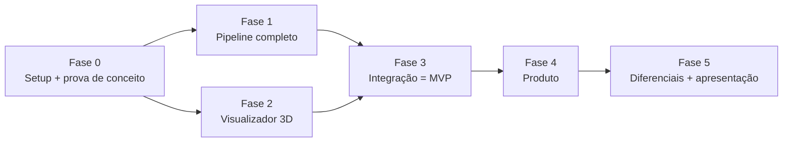

# Fases do projeto

Seis fases. **0 a 3 formam o MVP** (algo funcionando ponta a ponta para mostrar); 4 e 5 transformam em produto
e preparam a apresentação.

**Fases 1 e 2 rodam em paralelo** (pessoas diferentes): o front usa o `.glb` gerado pela CLI enquanto a API não existe.

| Fase | Objetivo | Frentes | Esforço estimado* | Doc |
|---|---|---|---|---|
| 0 | Repositório, stacks instaladas, pipeline mínimo provado com fotos reais | todas | 1 semana | [fase-0](fase-0-setup-e-poc.md) |
| 1 | Pipeline com suavização, decimação, cor, presets, métricas, recorte da foto e contorno | pipeline | 2–2,5 semanas | [fase-1](fase-1-pipeline.md) |
| 2 | Visualizador 3D completo com conceitos de CG visíveis + visor 2D (zoom, pan, clipping), corte 3D, raycasting e transformações | front | 2,5–3 semanas | [fase-2](fase-2-visualizador.md) |
| 3 | API + banco + upload (com editor de foto) + status + visualizador + contorno/avisos integrados | back, banco, front | 2–2,5 semanas | [fase-3](fase-3-integracao-mvp.md) |
| 4 | Login, créditos, editor de transformações, exportações, textura UV, versões, S3 | todas | 2–3 semanas | [fase-4](fase-4-produto.md) |
| 5 | Raio-X do pipeline, LOD, régua 3D, presets, correção de máscara, incorporação, apresentação | todas | 2 semanas | [fase-5](fase-5-diferenciais.md) |

\* Estimativa para um grupo de 3–5 pessoas dedicando algumas horas por semana, executando com o Claude.
Ajuste no STATUS quando souberem a data de entrega.

**Adição de 01/10/2026 (ADR 0006):** a professora pediu recorte/clipping, zoom, transformações (mover/aumentar),
rastreamento e segmentação visíveis. Entraram F1-T11/T12, F2-T10 a T13 e F3-T13/T14 — todas no MVP. Mapa completo
em [08-ferramentas-similares.md](../08-ferramentas-similares.md).

## Como ler uma tarefa

Cada tarefa tem um **ID** (`F1-T03` = Fase 1, tarefa 3) e os blocos:

- **Frente** — pipeline, back, banco ou front (ajuda a distribuir entre pessoas)
- **Depende de** — o que precisa estar pronto antes
- **Como fazer** — o passo a passo técnico (é o que o Claude segue)
- **Testes** — testes automatizados obrigatórios da tarefa
- **Aceite** — como saber que terminou (verificável)
- **Conceito de CG** — o que essa tarefa demonstra para a disciplina (quando houver)

## Definição de pronto (vale para toda tarefa)

- [ ] Código no padrão (ruff/oxlint sem erros), em branch própria, com PR
- [ ] Testes da tarefa escritos e passando; `make test` verde
- [ ] STATUS atualizado, entrada no diário, CHANGELOG se for visível
- [ ] Revisado por outra pessoa (ou pelo Claude com o checklist) antes do merge
